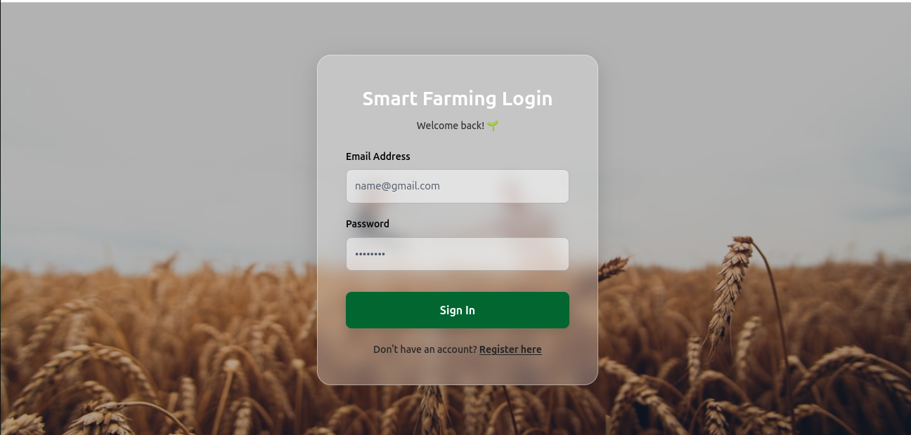
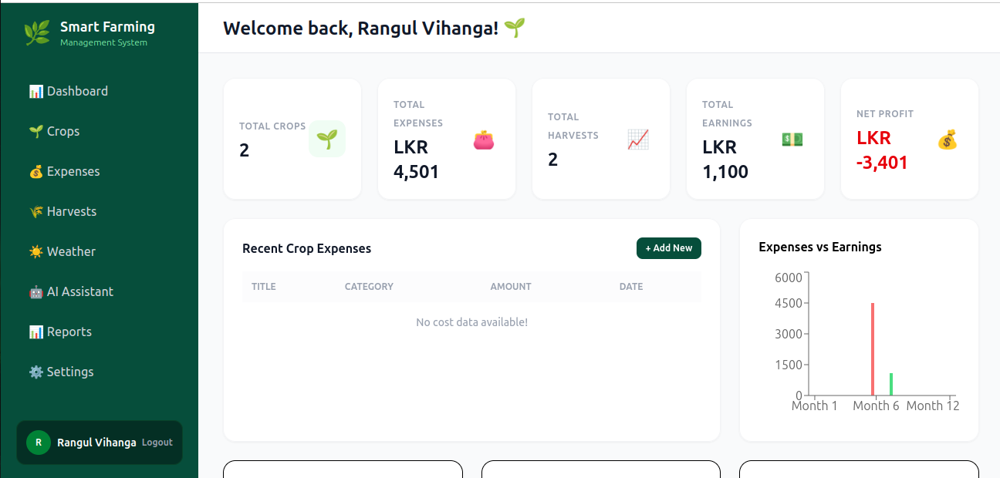
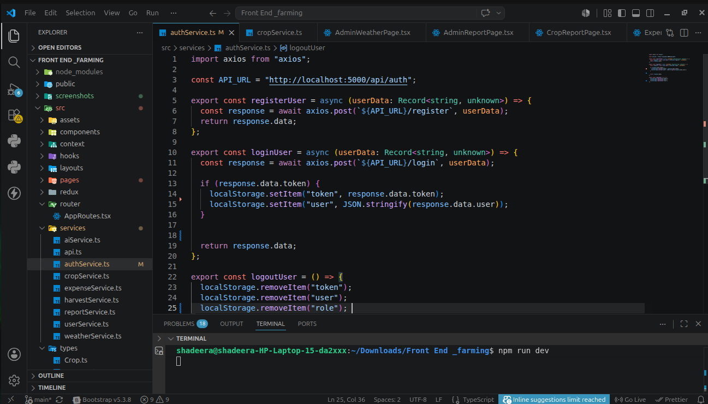
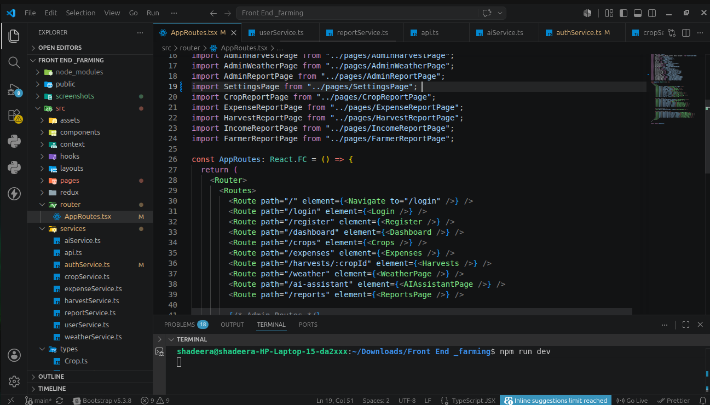
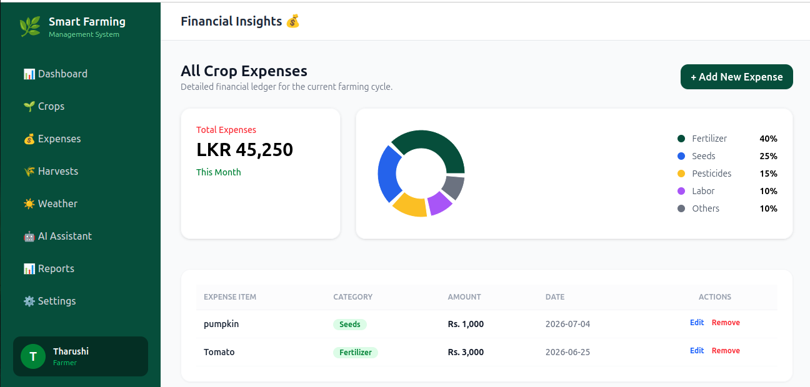

# Smart Farming Management System - Frontend

## Project Description

The frontend of the Smart Farming Management System is built using React, TypeScript, Tailwind CSS, and Redux Toolkit. It provides farmers with a modern and responsive user interface to manage crops, track harvests, monitor expenses, and interact with the AI Farming Assistant.

## Technologies Used

* React
* TypeScript
* Tailwind CSS
* Redux Toolkit
* Axios
* React Router DOM

## Features

* User Authentication (Login/Register)
* Crop Management Interface
* Harvest Analytics Dashboard
* Expense Tracking
* AI Farming Assistant Chat Interface
* Responsive Mobile-Friendly Design

## Deployed URLs

- *Frontend:* [Smart Farming Frontend](https://smart-farming-frontend-ji2k-d41e743z6.vercel.app/)
- *Backend:* [Smart Farming Backend](https://smart-farming-backend-ddeg.vercel.app/)

## Setup Instructions

```bash
# Clone the repository
git clone <frontend_repository_url>

# Install dependencies
npm install

# Start development server
npm run dev
```
## Screenshots

### Login Page


### Dashboard


### Crop Management


### Harvest Analytics


### Expense Management


### AI Farming Assistant


## Backend API

Make sure the backend server is running and update the API base URL in the frontend configuration.

## Author

Tharushi Shadeera

GDSE74

Software Engineering Student
